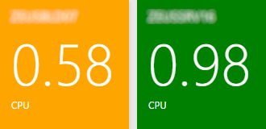
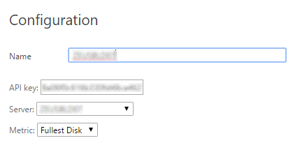
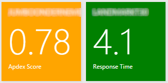
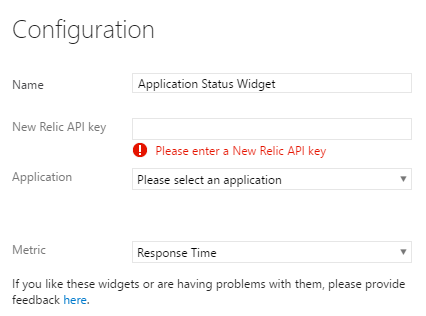

#New Relic Dashboard Widgets#
This extensions contains a collection of dashboard widgets that can be added to a dashboard in order to
display various metrics from [New Relic](http://www.newrelic.com).

**Note:** These widgets are neither developed nor endorsed by New Relic. 

## Release Notes
* 1.0.8 - Better error handling, for example if applications or servers no longer exist in New Relic
* 1.0.5 - Use out-of-the-box styles provided by Visual Studio Team Services

## Supported widgets
The following widgets are currently supported:

* Server Status Widget
* Application Status Widget

### Server Status Widget
This widget displays the current health status of a specific New Relic server, as well as a (configurable) key metric of that server.

The following configuration options are available:

* **Name** - Name of the widget as it is displayed on the dashboard.
* **API Key** - A New Relic API key that can be used to access the [New Relic API](https://docs.newrelic.com/docs/apis/rest-api-v2/requirements/new-relic-rest-api-v2-getting-started).
* **Server** - After entering a New Relic API key this list will be populated with the available servers in your account. Then choose the server you want to see.
* **Metric** - Finally choose the metric you want displayed on the widget. The following options are available:
    * CPU
    * Disk I/O
    * Memory
    * Fullest Disk

### Application Status Widget
This widgets displays the current health status of a specific New Relic application, as well as a (configurable) key metric of that application.

The following configuration options are available:+1:

* **Name** - Name of the widget as it is displayed on the dashboard. Use the default name of Application Status Widget to display the application's name on the dashboard.
* **API Key** - A New Relic API key that can be used to access the [New Relic API](https://docs.newrelic.com/docs/apis/rest-api-v2/requirements/new-relic-rest-api-v2-getting-started).
* **Application** - After entering a New Relic API key this list will be populated with the available applications in your account. Then choose the application you want to see.
* **Metric** - Finally choose the metric you want displayed on the widget. The following options are available:
    * Response Time
    * Throughput
    * Apdex Score
    * Error Rate